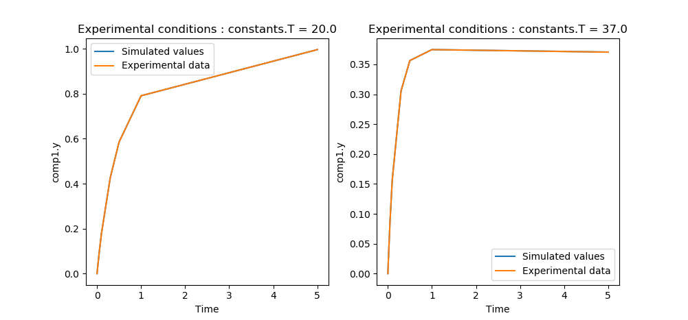

# About data.csv files

The data file should be loaded as a .csv file, with <strong>coma as separator</strong>.

The file should be organised following the template:

| Time | Values | Experiment number | Experimental condition |
| ---- | ------ | ----------------- | ---------------------- | 
| 0 | 0.094 | 2019110601 | 20 |
| 0.3 | 0.654 | 2019110601 | 20 |
| 0.6 | 0.844 | 2019110601 | 20 |
| 0 | 0.094 | 2019110601 | 37 |
| 0.3 | 0.253 | 2019110601 | 37 |
| 0.7 | 0.865 | 2019110601 | 37 |

Note : the rows do not need to be sorted. While loading the data table, the table will be sorted with increasing experimental conditions (in a first time), and with increasing times (in a second time), thus resulting in a data structure similar to the one above.

# Architecture of the loaded data

The data is loaded as a data_exp structure. <strong>data_exp</strong> is a structure with entries:
  - <strong>times</strong> is a list of all loaded experiments, with all time points for each ;
  - <strong>values</strong> is a list with the same shape, containing the data measured at those time points ;
  - <strong>exp_nums</strong> is a list of the labels of the experiments, as floats.
  - <strong>exp_conds</strong> is a list of the values taken by the experimental condition for each experiment. It is of length the number of experiments.
  - <strong>.fitting_instructions</strong> after call of the function <strong>Add_fitting_instructions</strong>. This subclass has entries:
    - <strong>fitted_params_annot</strong> is a list of strings for the parameters fitted for the model. It is presented as ['compartment.parameter_fitted1', 'compartment.parameter_fitted2', ...]. It should match the annotations of the .mmt model used for simulations/fitting.
    - <strong>exp_cond_param_annot</strong> is a string. It should match the annotation of the .mmt model for the varying experimental condition used to generate the data.
    - <strong>sim_output_param_annot</strong> is a string. It should match the annotation of the .mmt model output.

# Use of the simulation and inference tools included in this package.

Check the example.py file for the example code. If you want to run it, please change the directories to the directories of the 

##  Importing the necessary libraries:

```python
import sabs_pkpd
```

## Setting up the parameters for simulation and fitting
```python
sabs_pkpd.constants.n = 2
sabs_pkpd.constants.s = sabs_pkpd.run_model.set_myokit_simulation('./tests/test resources/pints_problem_def_test.mmt')
```
Set up the constants n and s:
  - <strong>n</strong> is the number of parameters fitted
  - <strong>s</strong> is the myokit model loaded for myokit.simulation. Please make sure when entering the filename that the subdirectory key is / not \

For a better comprehension of the example, please refer to the .mmt model in the /tests/test resources/ directory.

## Loading experimental data and setting up the instructions for fitting
```python
fit_param_annot = ['constants.unknown_cst', 'constants.unknown_cst2']
exp_cond_annot = 'constants.T'
model_output_annot = 'comp1.y'
sabs_pkpd.constants.data_exp = sabs_pkpd.load_data.load_data_file('./tests/test resources/load_data_test.csv')
sabs_pkpd.constants.data_exp.Add_fitting_instructions(fit_param_annot, exp_cond_annot, model_output_annot)
```
Here is an example of how to load a data. Refer to the section above for the structure of the .csv file loaded. Here, we decide to fit the parameters 'constants.unknown_cst' and 'constants.unknown_cst2' of the .mmt model previously loaded. 
In this toy example, we consider the case where two measurements were done at 'constants.T' = 20 and 37.
We consider also that the data measured in the csv file is modelled as 'comp1.y'.

## Parameter inference instructions
```python
initial_point = [0.5, 0.3]
boundaries_low = [0, 0]
boundaries_high = [1, 1]
```
Here, the initial point is set as ``` 'constants.unknown_cst' = 0.5``` and ```'constants.unknown_cst2' = 0.3``` . 
The parameters are allowed to vary here from 0 to 1.

## Call of the inference function
```python
inferred_params = sabs_pkpd.pints_problem_def.infer_params(initial_point, sabs_pkpd.constants.data_exp, boundaries_low, boundaries_high)
```
This returns ```inferred_params``` as a ```numpy.array``` of the optimised parameters. In this toy problem, the data was generated with parameters ``` 'constants.unknown_cst' = 0.1``` and ```'constants.unknown_cst2' = 0.1``` . 

## Plot the model with optimised parameters against experimental data
```python
sabs_pkpd.run_model.plot_model_vs_data(['constants.unknown_cst', 'constants.unknown_cst2'], inferred_params, sabs_pkpd.constants.data_exp, sabs_pkpd.constants.s)
```
The output is presented in the figure below:

