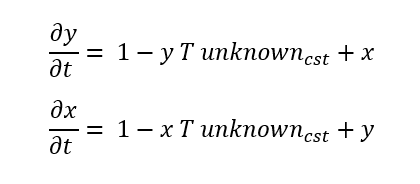
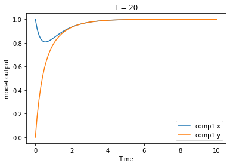
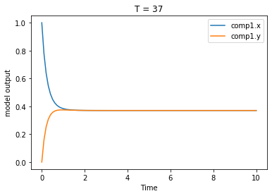

# Toy problem presentation

The toy model for all tests and user tutorial is available in the path ./tests/test resources/pints_problem_def_test.mmt. The model is written in .mmt format, ready to be used by Myokit. A CellML version of the same model is also available in the same directory.

## Equations

This model is composed of two variables linked via a differential equation as described below. To refer to <strong>x</strong> and <strong>y</strong>, the annotations of the model are respectively <strong>'comp1.x'</strong> and <strong>'comp1.y'</strong>.

## Constants

This model has three constants :
  - <strong>T</strong> treated as the experimental condition varying when generating the data. In the .csv file containing the data used for the inference of parameters, we have data recorded at T = 20 and at T = 37. When running the model to fit the unknown parameters, the simulation is looped over T.
  - <strong>unknown_cst</strong> and <strong>unknown_cst2</strong> two unknown constants (set at 0.1 when generating the synthetic data) that are used to test the inference of parameters. 
  
## Model output

The figure below represents the outputs <strong>x</strong> and <strong>y</strong> against the time, for T = 20 and T = 37.

